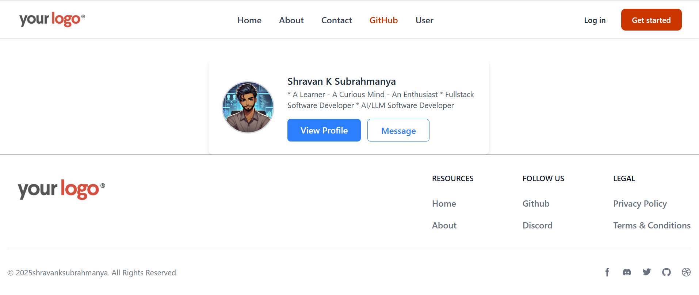
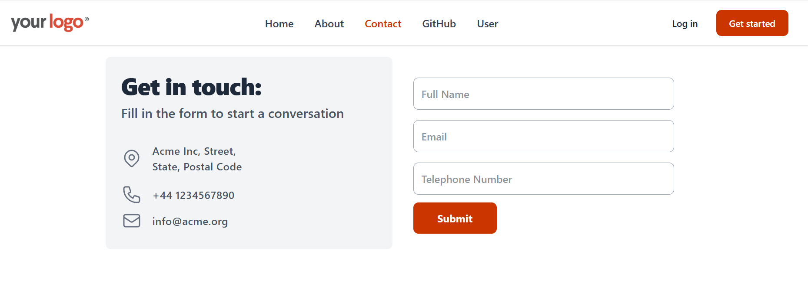
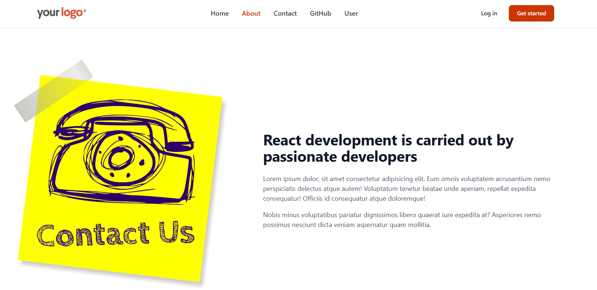

# React Router Concepts Demo

This project demonstrates key React Router concepts through a sample application built with [Vite](https://vitejs.dev/), [React](https://reactjs.org/), and [react-router-dom](https://reactrouter.com/). The application is styled using [Tailwind CSS](https://tailwindcss.com/).

## Project Overview

The application includes the following pages:

**Home Page:** The landing page of the application.
**About Page:** Provides information about the project.
**Contact Page:** Contains contact details or a contact form.
**User Page:** Displays user data fetched from GitHub using the `useLoaderData` hook from `react-router-dom`.
**GitHub Page:** Offers additional GitHub related information.

## Key Features

**Routing:** Utilizes `react-router-dom` for client-side routing.
**Data Fetching:** Leverages the `useLoaderData` hook to fetch GitHub user data.
**Fast Development:** Built with Vite for speedy builds and hot module replacement.
**Modern Styling:** Styled with Tailwind CSS.

## Installation

1. **Clone the repository:**

   ```bash
   git clone https://github.com/shravanksubrahmanya/react-router-demo.git
   ```

2. **Navigate to the project directory:**
   ```bash
   cd react-router-demo
   ```
3. **Install dependencies:**
   ```bash
   npm install
   ```
4. **Run the development server:**
   ```bash
   npm run dev
   ```

## Screenshots

Check out the screenshots below to see the application in action:





## Usage

After running the development server, open your browser and go to [http://localhost:3000](http://localhost:3000) (or the port specified by Vite) to explore the application. Use the navigation links to switch between the Home, About, Contact, User, and GitHub pages.

## Contributing

Contributions are welcome! Feel free to fork the repository and submit pull requests.

## License

This project is licensed under the [MIT License](LICENSE).
